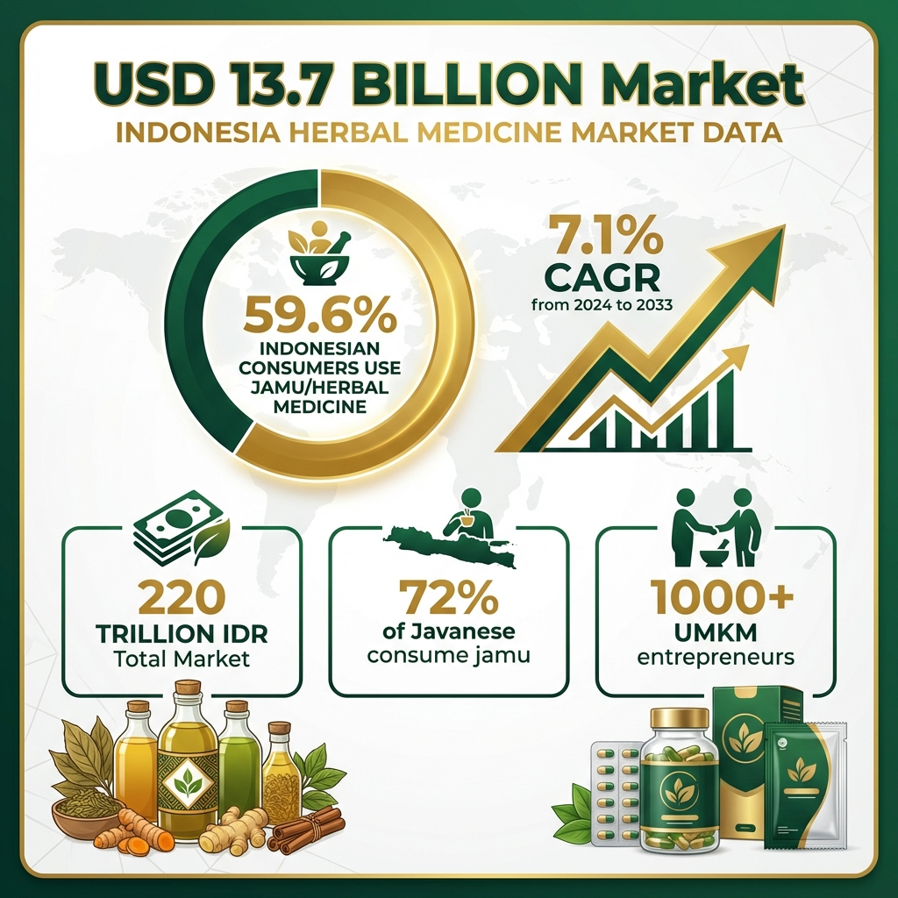
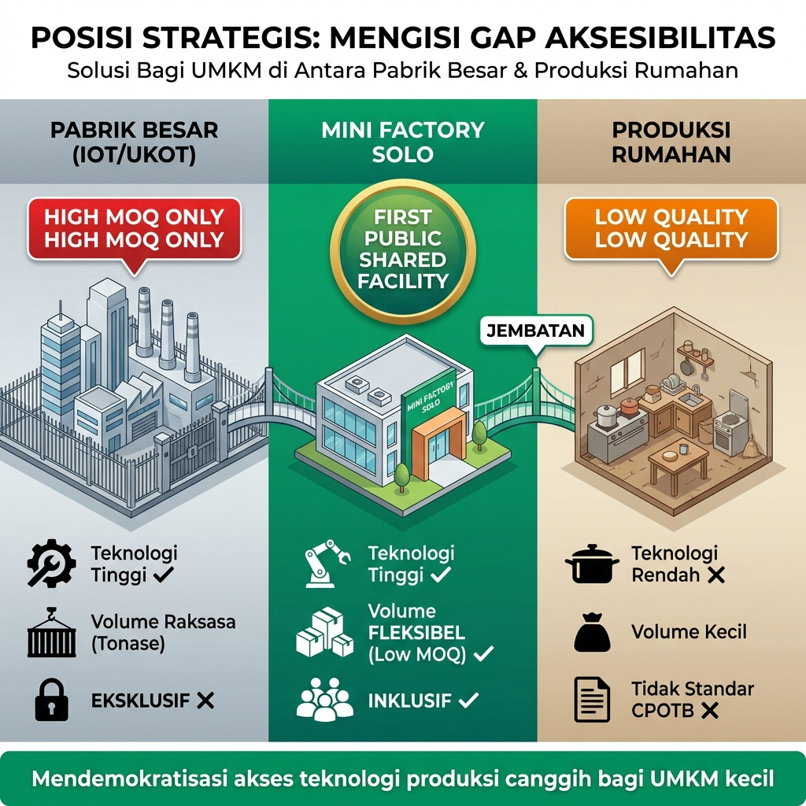

# UNLOCK Rp 220 TRILIUN

## Solo Wellness Manufacturing Hub: Transforming 100 UMKM from Informal to International

**Mini Factory Pengolahan Rempah Solo Technopark**  
**Fasilitas Bersama CPOTB untuk Pemberdayakan UMKM Herbal**

---

**Pemerintah Kota Surakarta**  
**Solo Technopark**

Februari 2026

---

## 📄 ONE-PAGE EXECUTIVE SUMMARY

### THE OPPORTUNITY: Rp 220 Triliun Market × 100 UMKM × Solo Wellness City Status

| **THE PROBLEM** | **THE SOLUTION** |
|-----------------|------------------|
| **100+ UMKM herbal Solo** stuck di pasar informal | **Mini Factory:** First shared CPOTB facility di Jawa Tengah |
| ❌ Tidak bisa akses CPOTB → Tidak bisa dapat izin BPOM | ✅ **4-in-1 Ecosystem:** Production + Training + Tourism + R&D |
| ❌ Missing **Rp 220 triliun** market opportunity | ✅ **Investment:** Rp 500M (Pemkot Rp 300M + CSR Rp 200M) |
| ❌ Revenue stuck Rp 5-10 juta/bulan | ✅ **Capacity:** 100 UMKM dapat dilayani bergantian |
| ❌ 4.4 juta wisatawan lewat tanpa bisa capitalize | ✅ **Wellness Tourism:** Integrated destination |

| **THE IMPACT** | **THE RETURNS** |
|----------------|-----------------|
| ✅ **100 UMKM** empowered → Rp 12B additional revenue/year | 💰 **ROI:** 42% Year 1 |
| ✅ **200+ SDM** certified BNSP annually | 💰 **Payback:** 2.4 years |
| ✅ **Solo = Indonesia's Wellness Manufacturing Hub** | 💰 **Economic Impact:** Rp 14.37B Year 1 |
| ✅ **300+ indirect jobs** created | 💰 **Break-even:** Month 24 |
| ✅ **First mover advantage** di Jawa Tengah | 💰 **Self-sustaining** by Year 2 |

### ⏰ WINDOW OF OPPORTUNITY: 12-18 BULAN

**Wonderful Indonesia Wellness 2026** di Solo (Q4 2026) - Kita harus ready!  
**Kompetitor** mulai bergerak: Yogyakarta planning shared facility (Q1 2027)  
**Government grants** Kemenperin available hingga Desember 2026

**INVEST NOW OR MISS THE OPPORTUNITY**

---

## 🎯 HERO STORY: Mengapa Mini Factory Urgent dan Penting

### Kisah Ibu Siti: Representasi 100+ UMKM Herbal Solo

**Ibu Siti Rahayu (47 tahun)** telah membuat jamu kunyit asam selama 22 tahun di kawasan Pasar Gede, Solo. Resepnya turun-temurun dari neneknya yang merupakan sinder (penjual jamu gendong) legendaris di era 1970-an. Kualitas jamunya terbukti—pelanggan setianya mencapai 40-50 orang per hari, dan banyak yang sudah mengonsumsi produknya selama puluhan tahun.

**Tapi ketika 4.4 juta wisatawan datang ke Solo tahun 2024** [[Dinas Pariwisata Surakarta, 2024](https://pariwisatasolo.surakarta.go.id/wp-content/uploads/2025/04/Kunjungan-Wisatawan-Daya-Tarik-Wisata-Kota-Surakarta-per-Maret-2025.pdf)], Ibu Siti hanya bisa melihat mereka lewat. Hotelnya tidak bisa stock produknya. Toko oleh-oleh modern menolak karena tidak ada izin BPOM. E-commerce marketplace seperti Tokopedia dan Shopee mensyaratkan sertifikasi yang tidak dia miliki.

**Kenapa?** Karena untuk mendapatkan izin edar BPOM, produk harus diproduksi di **fasilitas bersertifikat CPOTB (Cara Pembuatan Obat Tradisional yang Baik)**. Untuk membangun fasilitas CPOTB sendiri, Ibu Siti harus invest **Rp 300-500 juta** [[BPOM PerBPOM No. 11/2025](https://peraturan.bpk.go.id/Download/381648/peraturan-bpom-no-11-tahun-2025.pdf)]—mustahil untuk UMKM dengan revenue Rp 8-10 juta/bulan.

**Akibatnya:**
- Revenue stuck di Rp 8-10 juta/bulan (hanya pasar tradisional)
- Tidak bisa ekspansi ke hotel, minimarket, atau e-commerce
- Tidak bisa hire karyawan (masih produksi sendiri di dapur rumah)
- Tidak bisa capitalize dari 4.4 juta potential customers yang datang ke Solo

**Seperti Ibu Siti, ada 100+ UMKM herbal Solo** yang punya produk bagus, resep tradisional terbukti, dan customer base loyal—tapi **stuck di pasar informal** karena tidak bisa akses fasilitas CPOTB [[UNS Vokasi, 2024](https://vokasi.uns.ac.id/2025/06/20/program-studi-d3-upw-gelar-event-solo-wellness-tourism-expo-2025-swte-2025-di-tahun-pertama/)].

### Transformasi yang Akan Terjadi dengan Mini Factory

**Setelah Mini Factory beroperasi, Ibu Siti akan bisa:**

✅ **Produksi di fasilitas CPOTB-certified** (toll manufacturing Rp 50k-80k/kg)  
✅ **Mendapatkan izin edar BPOM** dalam 6-9 bulan  
✅ **Jual di hotel, minimarket, apotek** (akses pasar modern)  
✅ **Ekspansi ke e-commerce** (Tokopedia, Shopee, TikTok Shop)  
✅ **Revenue meningkat 3-4x** menjadi Rp 25-40 juta/bulan  
✅ **Hire 2-3 karyawan** (create jobs)  
✅ **Naik kelas** dari mikro ke kecil/menengah

**Impact Multiplier:**
- **100 UMKM** seperti Ibu Siti × **Rp 15 juta additional revenue/month** = **Rp 1.5 miliar/bulan** economic impact
- **Rp 18 miliar/tahun** additional economic activity di Solo
- **300+ indirect jobs** (packaging, delivery, marketing, retail)

> **💡 INSIGHT KRITIS:**  
> Ini bukan tentang "menciptakan pasar baru"—**pasar sudah ada** (Rp 220 triliun), **demand sudah ada** (59.6% populasi Indonesia konsumsi jamu), **customers sudah ada** (4.4 juta wisatawan Solo).  
> Yang hilang hanya satu: **fasilitas produksi yang memungkinkan UMKM naik kelas**.  
> **Mini Factory adalah missing piece yang akan unlock seluruh ekosistem ini.**

---

## 📖 GLOSARIUM ISTILAH PENTING

Untuk memudahkan pemahaman, berikut penjelasan istilah-istilah teknis yang digunakan dalam proposal ini:

| Istilah | Kepanjangan | Penjelasan Sederhana |
|---------|-------------|----------------------|
| **CPOTB** | Cara Pembuatan Obat Tradisional yang Baik | Standar kebersihan dan kualitas produksi yang diwajibkan pemerintah untuk produk jamu/herbal agar bisa dapat izin edar BPOM |
| **UMKM** | Usaha Mikro Kecil Menengah | Pengusaha kecil seperti produsen jamu rumahan, warung herbal, dll |
| **BPOM** | Badan Pengawas Obat dan Makanan | Lembaga pemerintah yang mengawasi keamanan obat, makanan, dan produk kesehatan |
| **BNSP** | Badan Nasional Sertifikasi Profesi | Lembaga yang mengeluarkan sertifikat kompetensi untuk tenaga kerja terlatih |
| **OT** | Obat Tradisional | Jamu, herbal, dan produk kesehatan alami Indonesia |
| **QC** | Quality Control | Kontrol kualitas—pengujian untuk memastikan produk aman dan berkualitas |
| **R&D** | Research & Development | Riset dan pengembangan produk baru |
| **ROI** | Return on Investment | Pengembalian investasi—berapa persen keuntungan dari modal yang ditanam |
| **CAGR** | Compound Annual Growth Rate | Tingkat pertumbuhan rata-rata per tahun |
| **PAD** | Pendapatan Asli Daerah | Pendapatan pemerintah kota dari retribusi, usaha daerah, dll |
| **SDG** | Sustainable Development Goals | Tujuan Pembangunan Berkelanjutan PBB |
| **SDM** | Sumber Daya Manusia | Tenaga kerja terlatih |
| **MOQ** | Minimum Order Quantity | Jumlah minimum pesanan yang harus dipenuhi |
| **Toll Manufacturing** | Maklon | Model bisnis dimana UMKM bayar per kg untuk produksi, tanpa harus beli mesin sendiri |

---

## 📋 RINGKASAN EKSEKUTIF

Solo berdiri di persimpangan sejarah yang luar biasa. Sebagai **satu dari tiga kota pilot project nasional wellness tourism** bersama Bali dan Yogyakarta [[Kemenparekraf, 2024](https://bob.kemenparekraf.go.id/126155-siaran-pers-wamenparekraf-dorong-kota-solo-jadi-pilot-project-wellness-tourism-indonesia/)], Solo telah menarik **4.4 juta pengunjung di tahun 2024** [[Dinas Pariwisata Surakarta, 2024](https://pariwisatasolo.surakarta.go.id/wp-content/uploads/2025/04/Kunjungan-Wisatawan-Daya-Tarik-Wisata-Kota-Surakarta-per-Maret-2025.pdf)]. Event **Wonderful Indonesia Wellness 2025** menghasilkan transaksi UMKM senilai **Rp 8.5-9 miliar** [[Kemenparekraf, 2025](https://kemenpar.go.id/berita/ajang-wonderful-indonesia-wellness-2025-geliatkan-ekonomi-masyarakat)], membuktikan bahwa pasar wellness tourism bukan hanya potensi—**ini adalah realitas yang sedang terjadi sekarang**.

Namun, di balik kesuksesan ini, terdapat **gap kritis** yang menghalangi Solo untuk menjadi true wellness hub: **lebih dari 100 UMKM herbal lokal** tidak memiliki akses ke fasilitas produksi bersertifikat **CPOTB**. Mereka memiliki resep tradisional, pengetahuan turun-temurun, dan semangat kewirausahaan—tetapi **tidak bisa mendapatkan izin edar BPOM** karena ketiadaan fasilitas produksi yang memenuhi standar.

**Mini Factory Pengolahan Rempah** adalah solusi transformatif yang akan:

- ✅ Memberdayakan **100 UMKM** dengan akses produksi bersertifikat CPOTB
- ✅ Menciptakan **landmark wellness tourism** yang unik di Indonesia
- ✅ Menghasilkan **200+ SDM tersertifikasi BNSP** per tahun
- ✅ Memberikan **ROI 42% di tahun pertama** dengan model bisnis berkelanjutan
- ✅ Memposisikan Solo sebagai **Indonesia's Wellness Manufacturing Hub**

Dengan investasi **Rp 500 juta** (Pemkot Rp 300M + CSR Perusahaan Rp 200M), Solo akan memiliki **fasilitas PERTAMA dan SATU-SATUNYA** di Jawa Tengah yang menggabungkan produksi CPOTB, pelatihan BNSP, wellness tourism, dan R&D dalam satu ekosistem terintegrasi.

### ⏰ WINDOW OF OPPORTUNITY: Mengapa Sekarang adalah Waktu yang TEPAT

**Momentum yang Tidak Boleh Terlewatkan:**

1. **Wonderful Indonesia Wellness 2026** akan diadakan di Solo (Q4 2026)
   - Event nasional dengan expected 5,000+ visitors
   - Showcase opportunity untuk Mini Factory
   - **Kita harus ready sebelum event ini!**

2. **Kompetitor Mulai Bergerak**
   - Yogyakarta sedang planning shared facility serupa (target Q1 2027)
   - Semarang exploring CPOTB incubator concept
   - **First mover advantage hanya 12-18 bulan**

3. **Government Grants Window**
   - Kemenperin IKM OT program: Rp 100-140 juta available hingga Desember 2026 [[Kemenperin, 2025](https://ikm.kemenperin.go.id)]
   - BPOM SIPEMANDU mentoring gratis untuk UMKM OT [[BPOM, 2025](https://www.pom.go.id/umkm)]
   - **Timing perfect untuk maximize government support**

4. **Market Momentum**
   - Pasar herbal Indonesia tumbuh 7.1% CAGR [[Custom Market Insights, 2024](https://www.custommarketinsights.com/report/indonesia-herbal-medicine-market/)]
   - Solo Wellness City initiative gaining traction
   - **Capitalize sebelum market saturated**

> **⚠️ CRITICAL TIMING:**  
> Setelah kita establish dan membantu 100 UMKM mendapatkan izin BPOM, akan **sangat sulit bagi kompetitor untuk masuk** karena:  
> (1) **Brand loyalty**—UMKM akan setia ke fasilitas yang sudah bantu mereka naik kelas  
> (2) **Network effects**—semakin banyak UMKM yang join, semakin kuat ekosistemnya  
> (3) **High barrier to entry**—kompetitor harus invest ratusan juta untuk equipment + sertifikasi CPOTB  
>  
> **INVEST NOW OR MISS THE OPPORTUNITY**

**Ini bukan hanya investasi infrastruktur—ini adalah investasi dalam masa depan ekonomi kreatif Solo.**

---

## 🚀 MENGAPA SEKARANG? MOMENTUM YANG TIDAK BOLEH TERLEWATKAN

### 1. Solo Wellness City: Dari Pilot Project Menjadi National Leader

Solo tidak lagi "berpotensi" menjadi wellness destination—**Solo SUDAH MENJADI wellness destination**. Data menunjukkan momentum yang luar biasa:

**Status Resmi:**

- ✅ **National Wellness Tourism Pilot Project** [[Kemenparekraf, 2024](https://bob.kemenparekraf.go.id/126155-siaran-pers-wamenparekraf-dorong-kota-solo-jadi-pilot-project-wellness-tourism-indonesia/)]
- ✅ Designated bersama Bali dan Yogyakarta [[Jateng Prov, 2024](https://jatengprov.go.id/beritadaerah/solo-jadi-percontohan-wellness-city-di-indonesia/)]
- ✅ **"Solo Wellness City"** initiative [[Kemenparekraf, 2024](https://bob.kemenparekraf.go.id/372700-wonderful-indonesia-wellness-dorong-solo/)]

**Pertumbuhan Eksponensial:**

- **4.4 juta total pengunjung** tahun 2024 [[Dinas Pariwisata Surakarta, 2024](https://pariwisatasolo.surakarta.go.id/wp-content/uploads/2025/04/Kunjungan-Wisatawan-Daya-Tarik-Wisata-Kota-Surakarta-per-Maret-2025.pdf)]
- **1.305 juta pengunjung** Q1 2025 (on track untuk growth) [[Dinas Pariwisata Surakarta, 2025](https://pariwisatasolo.surakarta.go.id/wp-content/uploads/2025/04/Kunjungan-Wisatawan-Daya-Tarik-Wisata-Kota-Surakarta-per-Maret-2025.pdf)]
- **Wonderful Indonesia Wellness 2025:** 3,700+ visitors, **Rp 8.5-9 miliar** transaksi UMKM [[Kemenparekraf, 2025](https://kemenpar.go.id/berita/ajang-wonderful-indonesia-wellness-2025-geliatkan-ekonomi-masyarakat)]

**Ekosistem yang Berkembang:**

- **>100 UMKM aktif** di sektor wellness (spa, jamu, yoga) [[UNS Vokasi, 2024](https://vokasi.uns.ac.id/2025/06/20/program-studi-d3-upw-gelar-event-solo-wellness-tourism-expo-2025-swte-2025-di-tahun-pertama/)]
- Kontribusi PAD pariwisata: **Rp 60.837 miliar** (2022-2023) [[Jurnal Surakarta, 2023](https://jurnal.surakarta.go.id/index.php/jbs/article/download/84/101/419)]

**Apa Artinya Angka-Angka Ini untuk Solo dan UMKM?**

Bayangkan Solo seperti **tambang emas yang sudah ditemukan**: 4.4 juta wisatawan datang setiap tahun, pemerintah pusat sudah memberikan status pilot project nasional, dan event Wonderful Indonesia Wellness 2025 membuktikan bahwa UMKM bisa dapat transaksi Rp 8.5-9 miliar hanya dalam beberapa hari. Ini bukan lagi "potensi"—**ini adalah realitas yang sedang terjadi sekarang**. 

Namun, ada satu masalah besar: lebih dari 100 UMKM herbal Solo seperti **penambang tanpa alat**. Mereka melihat peluang emas (4.4 juta potential customers), punya resep tradisional yang bagus, dan semangat kewirausahaan—tetapi **tidak bisa capitalize** karena tidak memiliki fasilitas CPOTB untuk mendapatkan izin BPOM. Akibatnya, mereka hanya bisa jual di warung dan pasar tradisional, dengan revenue stuck di Rp 5-10 juta/bulan, sementara jutaan wisatawan lewat begitu saja.

**Mini Factory adalah "alat bersama" yang akan unlock seluruh potensi ini.** Dengan akses ke fasilitas CPOTB, UMKM bisa mendapatkan izin BPOM dan naik kelas: dari pedagang informal menjadi entrepreneur bersertifikat, dari revenue Rp 5-10 juta/bulan menjadi Rp 15-40 juta/bulan, dari pasar lokal menjadi pasar nasional (4.4 juta tourists + e-commerce). 

Untuk Pemkot Solo, ini bukan sekadar investasi infrastruktur—**ini adalah investasi untuk memastikan Solo deliver hasil sebagai pilot project nasional**, meningkatkan pendapatan daerah dari UMKM yang naik kelas, dan memperkuat branding Solo sebagai "Indonesia's Wellness Manufacturing Hub". Dengan investasi Pemkot Rp 300 juta (60% dari total Rp 500M, sisanya CSR Rp 200M), Solo akan mendapatkan economic impact Rp 14.37 miliar di tahun pertama—**ROI 42% dan payback period hanya 2.4 tahun**.

> **💡 INSIGHT KRITIS:**  
> Solo memiliki **demand** (4.4 juta visitors), **supply** (100+ UMKM), dan **government backing** (pilot project status).  
> Yang hilang hanya satu: **fasilitas produksi yang memungkinkan UMKM naik kelas**.  
> **Mini Factory adalah missing piece yang akan unlock seluruh ekosistem ini.**

---

### 2. Pasar Herbal Indonesia: Rp 220 Triliun dan Terus Tumbuh

Indonesia bukan hanya "berpotensi" di industri herbal—**Indonesia ADALAH pemain utama global**:

**Ukuran Pasar:**

- **USD 13.732 miliar** (2024) ≈ **Rp 220 triliun** total market value [[Custom Market Insights, 2024](https://www.custommarketinsights.com/report/indonesia-herbal-medicine-market/)]
- **CAGR 7.1%** proyeksi hingga 2033 → USD 25.459 miliar [[Custom Market Insights, 2024](https://www.custommarketinsights.com/press-releases/indonesia-herbal-medicine-market-size/)]
- **Pertumbuhan 2x lipat** dalam 9 tahun ke depan

**Perilaku Konsumen:**

- **59.6% populasi Indonesia** mengonsumsi jamu/herbal [[Kemenkes Ristoja, 2024](https://gpjamu.org/yuk-sukseskan-jamu-jadi-ujung-tombak-kesehatan-masyarakat/)]
- **72.62% masyarakat Jawa** konsumen aktif jamu (lebih tinggi dari rata-rata nasional!) [[Kemenkes Ristoja, 2024](https://ojs.cahayamandalika.com/index.php/jomla/article/download/4545/3591/)]
- **6 dari 10 orang Indonesia** adalah potential customers

**Struktur Industri:**

- **1,000+ UMKM** entrepreneur jamu formal terdaftar [[BPOM, 2024](https://www.jamudigital.com/berita?id=Pekan_Jamu_Badan_POM_2024%3A_Jamu_sebagai_Industri_Unggulan_Nasional_Masa_Depan)]
- **87% industri OT adalah UMKM** [[Kemenperin, 2024](https://www.tvonenews.com/ekonomi/257347-ekspansi-industri-obat-bahan-alam-melejit-kemenperin-ungkap-segini-jumlah-produk-jamu-hingga-herbal-indonesia-yang-diekspor)]
- **Ini adalah industri UMKM by nature—perfect fit untuk shared facility model**

**Apa Artinya Pasar Rp 220 Triliun Ini untuk UMKM Solo?**

Bayangkan ada **kue raksasa senilai Rp 220 triliun** di atas meja, dan **6 dari 10 orang Indonesia** (59.6%) sudah suka makan kue ini (konsumsi jamu/herbal). Di Jawa, angkanya lebih tinggi lagi: **7 dari 10 orang** (72%) adalah konsumen aktif. Ini bukan pasar kecil atau niche—**ini adalah pasar mainstream yang tumbuh 7.1% per tahun** dan akan jadi 2x lipat lebih besar dalam 9 tahun ke depan. 

Yang menarik, **87% dari industri ini dikuasai oleh UMKM**, bukan perusahaan besar seperti Sido Muncul atau Deltomed. Artinya, ini adalah **industri yang memang cocok untuk UMKM**—bukan arena untuk korporasi raksasa.

**Tapi ada masalah besar:** Mayoritas UMKM hanya bisa "gigit pinggiran kue" karena mereka stuck di pasar informal (warung, pasar tradisional). Mereka tidak bisa akses **bagian tengah kue yang paling besar**—minimarket, apotek, e-commerce, hotel, dan 4.4 juta wisatawan Solo—karena tidak punya izin BPOM. 

**Mini Factory adalah "pisau" yang akan kasih UMKM Solo akses ke bagian tengah kue Rp 220 triliun ini.** Dengan fasilitas CPOTB, mereka bisa dapat izin BPOM, masuk ke pasar formal, dan meng-capture share signifikan dari pasar raksasa ini. Ini bukan tentang "menciptakan pasar baru"—**pasar sudah ada, demand sudah ada, konsumen sudah ada**. Yang dibutuhkan hanya akses ke fasilitas produksi yang proper.

> **💡 INSIGHT KRITIS:**  
> Pasar Rp 220 triliun didominasi oleh UMKM (87%), tetapi mayoritas UMKM stuck di tahap informal karena tidak bisa akses CPOTB.  
> **Dengan Mini Factory, Solo dapat meng-capture share signifikan dari pasar ini.**

---

### 3. Posisi Strategis: Mengisi "Missing Link" Ekosistem Herbal

Riset komprehensif memetakan lanskap fasilitas herbal di Solo Raya. Meski Solo memiliki industri jamu yang kuat, terdapat **kekosongan fasilitas (gap)** yang signifikan bagi UMKM pemula:

| Fasilitas Existing | Layanan | Gap/Keterbatasan bagi UMKM |
|--------------------|---------|----------------------------|
| **Pabrik Besar (IOT/UKOT)** | Produksi massal (Deltomed, Air Mancur) | ❌ **High MOQ (Tonase)**, tidak terima maklon kecil |
| **Poltekkes Surakarta** | Pendidikan D3 Jamu | ❌ Fokus pendidikan, bukan produksi komersial |
| **BPVP/BLK Surakarta** | Pelatihan barista jamu | ❌ Hanya training, tanpa fasilitas processing |
| **Pasar Jamu Nguter** | Pasar tradisional | ❌ Pusat perdagangan, bukan fasilitas CPOTB |
| **Hortus Medicus** | Klinik saintifikasi | ❌ Fokus riset & klinik, bukan maklon produksi |

**Kesimpulan:** Mini Factory di Solo Technopark akan menjadi **FIRST PUBLIC SHARED FACILITY** di Jawa Tengah yang didedikasikan untuk **inkubasi bisnis** dengan Low MOQ.

**Kenapa Posisi Ini Sangat Penting?**

Bayangkan ekosistem produksi saat ini seperti **"Transportasi Publik vs Kendaraan Pribadi"**. Pabrik-pabrik besar (IOT/UKOT) ibarat **Jet Pribadi atau Bus Carteran**: canggih dan kapasitas besar, tapi mensyaratkan "penumpang" (order) dalam jumlah sangat banyak (MOQ tonase) yang mustahil dijangkau UMKM rintisan. UMKM saat ini terpaksa jalan kaki (produksi manual di dapur). 

**Mini Factory hadir sebagai "Bus Trans Solo"**: fasilitas publik yang terstandar, aman, dan bisa dinaiki siapa saja dengan tiket terjangkau (low MOQ). Ini memecahkan *bottleneck* terbesar industri: **aksesibilitas**. Dengan konsep **"Factory Sharing"**, mesin canggih yang biasanya eksklusif milik pabrik besar, kini terdemokratisasi untuk UMKM.

---

### 🛡️ DEFENSIBILITY STRATEGY: Bagaimana Kita Protect Market Position

**First mover advantage ini bukan cuma soal "duluan"—ini soal positioning strategis jangka panjang.** Setelah Mini Factory establish dan membantu 100 UMKM mendapatkan izin BPOM, akan sangat sulit bagi kompetitor untuk masuk karena:

#### 1. **Exclusive Partnerships & Government Backing**

**Strategic Alliances:**
- ✅ **MoU dengan Solo Technopark** sebagai official incubator (government-backed)
- ✅ **Partnership dengan UNS** untuk R&D exclusivity (academic collaboration)
- �� **CSR commitment** dari 3 perusahaan besar (Sido Muncul, Deltomed, Air Mancur) untuk 3 tahun
- 🟡 **BPOM SIPEMANDU** program mentoring gratis [[BPOM, 2025](https://www.pom.go.id/umkm)]

**Competitive Moat:**
- Kompetitor harus build relationships dari nol
- Government backing memberikan credibility instant
- Academic partnership untuk R&D sulit di-replicate

#### 2. **Network Effects**

**Semakin Banyak UMKM = Semakin Valuable:**
- **Shared knowledge:** UMKM saling belajar best practices (formulasi, packaging, marketing)
- **Bulk purchasing power:** 100 UMKM bisa nego harga bahan baku lebih murah
- **Cross-promotion:** UMKM bisa collaborate untuk bundling products
- **Community building:** Loyalty program, alumni network, referral bonuses

**Target:** 100 UMKM dalam 2 tahun = **switching cost sangat tinggi**

#### 3. **Regulatory Barriers**

**High Barrier to Entry:**
- **CPOTB certification:** 6-12 bulan proses + Rp 100-200 juta investment [[BPOM PerBPOM No. 11/2025](https://peraturan.bpk.go.id/Download/381648/peraturan-bpom-no-11-tahun-2025.pdf)]
- **BNSP LSP licensing:** Requires certified assessors + curriculum development
- **Equipment investment:** Rp 200 juta untuk machinery CPOTB-compliant
- **Expertise:** Need ex-BPOM consultants, trained operators, QC analysts

**First Facility Certified = Automatic Credibility Advantage**

#### 4. **Brand Recognition & Trust**

**Training Curriculum Standardized:**
- Develop proprietary BNSP curriculum (brand recognition)
- "Certified by Solo Wellness Hub" = quality stamp
- Alumni network sebagai brand ambassadors

**Intellectual Property (Future):**
- Develop proprietary formulations dengan UNS (patent-pending)
- Standardized packaging designs (trademark)
- Training materials copyright

> **💡 INSIGHT KRITIS:**  
> First mover advantage dalam industri yang sedang booming = **positioning strategis jangka panjang**.  
> Setelah kita establish, akan sangat sulit bagi kompetitor untuk masuk karena:  
> 1. **Brand loyalty** dari 100 UMKM yang kita bantu  
> 2. **Network effects** dari ekosistem yang terbangun  
> 3. **High barrier to entry** (CPOTB certification, equipment investment)  
> 4. **Government & academic partnerships** yang sudah established

---

