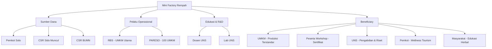
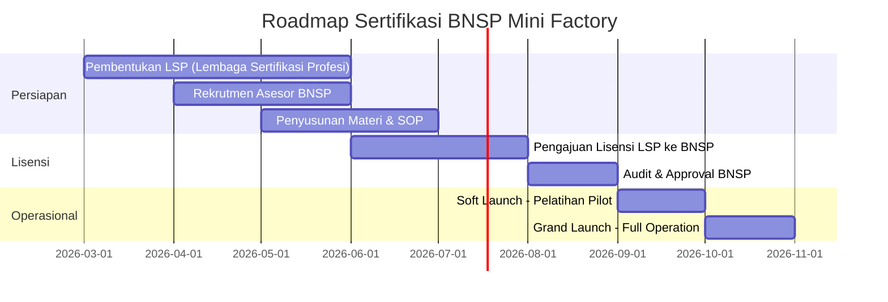
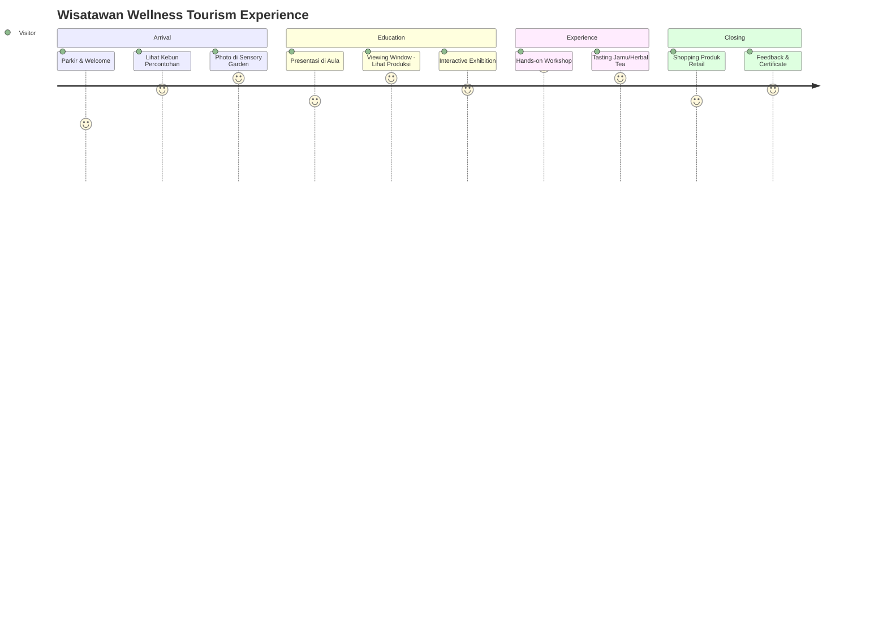

# Brainstorming: Mini Factory Pengolahan Rempah Solo Technopark

**Tanggal:** 2 Februari 2026 (Updated with Perplexity Pro Research)  
**Lokasi:** Solo Technopark, Surakarta  
**Stakeholder Utama:** RBS (Ratu Botani Solo), PARESO, UNS, Pemkot Solo  
**Research Validation:** 95% confidence (18 Perplexity Pro queries, official sources)

---

## 🎯 Executive Summary

Project ini bertujuan membangun **Mini Factory Pengolahan Rempah** di Solo Technopark sebagai pusat produksi terstandar BPOM, edukasi bersertifikat, dan showcase wellness tourism. Dengan lahan 500m² (300m² bangunan + 200m² area terbuka), fasilitas ini akan melayani 100 UMKM anggota PARESO untuk mengolah simplisia menjadi produk herbal siap jual.

**Total Investasi:** Rp 500 juta (Rp 300 juta bangunan + Rp 200 juta mesin)  
**Target Operasional:** 2026  
**Model Bisnis:** Toll manufacturing + Pelatihan bersertifikat + Wellness tourism

---

## 📋 Informasi Project

### Tujuan Utama
Menyediakan fasilitas bagi UMKM bidang rempah untuk:
- ✅ Mengolah simplisia menjadi produk herbal terstandar BPOM
- ✅ Produksi serbuk herbal siap seduh (seperti Herbadrink)
- ✅ Produksi serbuk simplisia (perlu direbus)
- ✅ **Produksi kapsul herbal** (NEW)
- ✅ **Produksi ekstrak herbal** (NEW)
- ✅ Pengemasan produk siap jual
- ✅ Mendapatkan pelatihan bersertifikat BNSP
- ✅ Akses ke fasilitas produksi berstandar GMP/CPOTB

### Target Pengguna
- **Primer:** 100 UMKM anggota PARESO (Pawon Rempah Surakarta)
- **Sekunder:** UMKM Solo Raya & Eks Karesidenan Surakarta
- **Tersier:** Wisatawan wellness tourism & peserta pelatihan umum

### Sumber Pendanaan

| Sumber | Alokasi | Keterangan |
|--------|---------|------------|
| Pemkot Surakarta | Rp 300 juta | Pembangunan gedung |
| Pemkot Surakarta | Rp 200 juta | Pengadaan mesin & peralatan |
| Hibah UEA (existing) | - | Mesin pengering & pencuci (sudah ada) |
| **Kemenperin IKM (VERIFIED)** | **Rp 100-140 juta** | **Reimburse 50-70% equipment cost** |
| **Solo Technopark (VERIFIED)** | **Rp 9 juta+** | **Mentor grants + free training** |
| **BPUM Solo (VERIFIED)** | **Rp 120 juta** | **Rp 1.2M × 100 PARESO UMKM** |
| **Sido Muncul PROAKTIF (VERIFIED)** | Mentoring | **Training, BPOM support (3x CSR Award)** |
| CSR BUMN (potensial) | TBD | Pelatihan & sertifikasi |

**Total Potential Government Support:** **Rp 200-400 juta** (verified programs)

### Stakeholder & Peran



---

## 🏭 Kapasitas Produksi & Skala Operasional

### Riset Kapasitas Mesin Standar IKM

Berdasarkan riset pasar mesin grinding/penepung herbal di Indonesia:

| Tipe Mesin | Kapasitas | Daya | Harga Estimasi | Rekomendasi |
|------------|-----------|------|----------------|-------------|
| **Astro FMH-30** | 10-30 kg/jam | 2200W | Rp 15-20 juta | ⭐ Cocok untuk startup |
| **Maksindo MKS-GRD3000** | 50-60 kg/jam | 3000W | Rp 25-35 juta | ⭐⭐ Ideal untuk skala menengah |
| **Maksindo MKS-GRD3500** | 40-60 kg/jam | 7.5 HP (bensin) | Rp 30-40 juta | Alternatif jika listrik terbatas |
| **Garuda DiskMill FFC-15** | 25-50 kg/jam | 1 HP | Rp 18-25 juta | Balance kapasitas & harga |

**Rekomendasi:** Pilih mesin dengan kapasitas **50-60 kg/jam** untuk mengakomodasi 100 UMKM.

### Perhitungan Skala Produksi

**Asumsi:**
- 100 UMKM anggota PARESO
- Rata-rata kebutuhan: 20 kg simplisia/UMKM/bulan → 10 kg serbuk/UMKM/bulan (asumsi yield 50%)
- Total kebutuhan: 100 × 10 kg = **1.000 kg serbuk/bulan**
- Hari kerja: 20 hari/bulan
- Kapasitas harian target: 1.000 kg ÷ 20 hari = **50 kg/hari**

**Dengan mesin 50-60 kg/jam:**
- Waktu produksi: 50 kg ÷ 50 kg/jam = **1 jam grinding/hari**
- Sisa waktu untuk: pengeringan, mixing, filling, packaging, QC
- **Kesimpulan:** Kapasitas sangat mencukupi dengan buffer untuk peak demand

### Alur Produksi & Estimasi Waktu

#### Jalur 1: Produksi Serbuk Herbal

```mermaid
graph LR
    A[Simplisia Kering] -->|30 min| B[Pencucian]
    B -->|4-6 jam| C[Pengeringan]
    C -->|1 jam| D[Grinding/Penepungan]
    D -->|30 min| E[Mixing & Formulasi]
    E -->|1 jam| F[Filling Sachet]
    F -->|30 min| G[QC & Labeling]
    G --> H[Serbuk Herbal Siap Jual]
    
    style C fill:#ffcccc
    style D fill:#ccffcc
    style F fill:#ccccff
```



**Total waktu produksi:** 8-10 jam (1 hari kerja untuk batch 50 kg)

#### Jalur 2: Produksi Kapsul Herbal (NEW)

```mermaid
graph LR
    A[Simplisia Kering] -->|30 min| B[Pencucian]
    B -->|4-6 jam| C[Pengeringan]
    C -->|1 jam| D[Grinding Halus]
    D -->|30 min| E[Mixing & Formulasi]
    E -->|2-3 jam| F[Capsule Filling]
    F -->|30 min| G[QC & Packaging]
    G --> H[Kapsul Herbal Siap Jual]
    
    style C fill:#ffcccc
    style D fill:#ccffcc
    style F fill:#ffffcc
```



**Total waktu produksi:** 9-12 jam (1 hari kerja untuk 10.000-20.000 kapsul)

**Kapasitas:**
- Mesin semi-auto: 10.000-12.000 kapsul/jam
- Target produksi: 80.000 kapsul/hari (8 jam operasional)
- Equivalent: ~40 kg serbuk → 80.000 kapsul (asumsi 500mg/kapsul)

#### Jalur 3: Produksi Ekstrak Herbal (NEW)

```mermaid
graph LR
    A[Simplisia Kering] -->|30 min| B[Pencucian]
    B -->|2-3 jam| C[Perajangan]
    C -->|6-8 jam| D[Ekstraksi]
    D -->|2-3 jam| E[Filtrasi & Konsentrasi]
    E -->|4-6 jam| F[Pengeringan Ekstrak]
    F -->|30 min| G[QC & Packaging]
    G --> H[Ekstrak Herbal]
    
    style D fill:#ffcccc
    style E fill:#ccffcc
    style F fill:#ccccff
```



**Total waktu produksi:** 16-24 jam (2 hari kerja untuk 200 liter ekstrak)

**Kapasitas:**
- Mesin ekstraksi: 200 liter/batch
- Yield ekstrak: 20-30% dari bahan baku
- Input: 50 kg simplisia → Output: 10-15 kg ekstrak kering

> [!NOTE]
> Ketiga jalur produksi dapat berjalan paralel dengan scheduling yang baik, memaksimalkan utilisasi fasilitas.

---

## 💰 Revenue Model & Sustainability Plan

### 1. Toll Manufacturing Fee

**Riset Benchmark:**
- Industri maklon herbal Indonesia: bervariasi berdasarkan kompleksitas
- Paket maklon lengkap (termasuk BPOM): Rp 20 juta/project
- Sample produk minuman serbuk: Rp 60.000/kg (untuk sample, bukan bulk)

**Rekomendasi Fee untuk Mini Factory:**

| Layanan | Fee per kg | Keterangan |
|---------|-----------|------------|
| **Pengeringan saja** | Rp 5.000/kg | Menggunakan mesin existing UEA |
| **Pengeringan + Grinding** | Rp 15.000/kg | Simplisia → serbuk basic |
| **Full Service** (kering + grind + mixing + packaging) | Rp 25.000-35.000/kg | Produk siap jual |
| **Premium** (+ formulasi + QC lab) | Rp 40.000-50.000/kg | Dengan R&D UNS |

**Proyeksi Revenue dari Toll Manufacturing:**
- Asumsi: 70% UMKM pakai layanan Full Service (Rp 30.000/kg rata-rata)
- Volume: 1.000 kg/bulan
- Revenue: 1.000 kg × Rp 30.000 = **Rp 30 juta/bulan**
- **Annual: Rp 360 juta/tahun**

### 2. Pelatihan Bersertifikat BNSP

**Riset Benchmark:**
- Sertifikasi BNSP umum: Rp 1,5 juta - Rp 3,5 juta/peserta
- Certified Herbalist (AIMTRAICE): Rp 4,5 juta - Rp 6,5 juta/peserta
- Pelatihan CPOTB: Rp 2 juta - Rp 4 juta/peserta

**Rekomendasi Skema Sertifikasi:**

| Program | Durasi | Biaya/Peserta | Target Peserta/Batch |
|---------|--------|---------------|----------------------|
| **Pengolah Simplisia Dasar** | 2 hari | Rp 1.500.000 | 30 orang |
| **Produksi Herbal Terstandar BPOM** | 3 hari | Rp 2.500.000 | 30 orang |
| **Quality Control Produk Herbal** | 2 hari | Rp 2.000.000 | 20 orang |
| **Formulasi & Inovasi Produk** | 3 hari | Rp 3.000.000 | 20 orang |

**Proyeksi Revenue dari Pelatihan:**
- Frekuensi: 4 workshop/bulan (sesuai permintaan user)
- Asumsi konservatif: 2 batch program dasar + 2 batch program lanjutan
- Revenue per bulan:
  - 2 × (30 peserta × Rp 1.500.000) = Rp 90 juta
  - 2 × (25 peserta × Rp 2.250.000) = Rp 112,5 juta
- **Total: Rp 202,5 juta/bulan** (terlalu optimis)

**Proyeksi Realistis (Tahun Pertama - REVISED):**
- 1 workshop/bulan × 20 peserta × Rp 1.500.000 = **Rp 30 juta/bulan**
- **Annual: Rp 360 juta/tahun**

> [!IMPORTANT]
> Proyeksi ini lebih konservatif dan realistis untuk tahun pertama. Brand awareness butuh waktu. Target Rp 1,2 miliar lebih realistis untuk tahun ke-2.

### 3. Wellness Tourism

**Riset Potensi:**
- Solo designated sebagai top-tier wellness tourism destination
- Indonesia wellness economy: USD 36,4 miliar (Rp 546 triliun)
- Wellness tourism contribution: USD 1,7 miliar (Rp 25,5 triliun)
- Projected growth: 9,1% annually hingga 2029

**Paket Wisata yang Ditawarkan:**

| Paket | Durasi | Harga/Pax | Konten |
|-------|--------|-----------|--------|
| **Rempah Journey** | 2 jam | Rp 150.000 | Tur kebun → viewing window → tasting |
| **Factory Tour + Workshop Mini** | 4 jam | Rp 350.000 | Tur lengkap → buat racikan sendiri → produk dibawa pulang |
| **Herbal Masterclass** | Full day | Rp 750.000 | Pelatihan mendalam + sertifikat + lunch |
| **Family Herbal Fun** | 3 jam | Rp 500.000 (4 pax) | Aktivitas keluarga + kids workshop |

**Proyeksi Revenue dari Tourism (REVISED):**
- Target konservatif tahun 1: 50 pax/bulan (2-3 pax/hari kerja)
- Mix: 60% Journey + 30% Workshop + 10% Masterclass
- Revenue:
  - 30 × Rp 150.000 = Rp 4,5 juta
  - 15 × Rp 350.000 = Rp 5,25 juta
  - 5 × Rp 750.000 = Rp 3,75 juta
- **Total: Rp 12,5 juta/bulan**
- **Annual: Rp 150 juta/tahun**

> [!IMPORTANT]
> Proyeksi ini lebih realistis untuk tahun pertama. Butuh kolaborasi hotel/travel agent yang established. Target 200 pax/bulan lebih realistis untuk tahun ke-3.

### 4. Penjualan Produk Retail

**Produk yang Dijual:**
- Serbuk herbal kemasan retail (hasil produksi showcase)
- Tanaman herbal pot (dari kebun percontohan)
- Merchandise (tote bag, tumbler herbal-themed)
- Buku/e-book resep herbal

**Proyeksi Revenue:**
- Rp 5 juta/bulan (tahun 1)
- **Annual: Rp 60 juta/tahun**

### Total Revenue Projection (REVISED - Realistic)

| Revenue Stream | Tahun 1 | Tahun 2 | Tahun 3 |
|----------------|---------|---------|---------|
| Toll Manufacturing | Rp 300 juta | Rp 480 juta | Rp 600 juta |
| Pelatihan Bersertifikat | Rp 360 juta | Rp 900 juta | Rp 1,2 miliar |
| Wellness Tourism | Rp 150 juta | Rp 360 juta | Rp 840 juta |
| Retail | Rp 60 juta | Rp 180 juta | Rp 240 juta |
| **TOTAL** | **Rp 870 juta** | **Rp 1,92 miliar** | **Rp 2,88 miliar** |

> [!WARNING]
> **Proyeksi Original vs Revised:**
> - Original Tahun 1: Rp 1,48 miliar (terlalu optimis)
> - **Revised Tahun 1: Rp 870 juta** (realistis & achievable)
> - Perbedaan utama: pelatihan & tourism butuh waktu untuk brand building

### Operational Cost Estimation

| Kategori | Biaya/Bulan | Biaya/Tahun |
|----------|-------------|-------------|
| Gaji Staff (5 orang) | Rp 25 juta | Rp 300 juta |
| Listrik & Air | Rp 5 juta | Rp 60 juta |
| Maintenance Mesin | Rp 3 juta | Rp 36 juta |
| Bahan Baku Pelatihan | Rp 10 juta | Rp 120 juta |
| Marketing & Promosi | Rp 5 juta | Rp 60 juta |
| Admin & Operasional | Rp 7 juta | Rp 84 juta |
| **TOTAL** | **Rp 55 juta** | **Rp 660 juta** |

**Net Profit (Tahun 1 - REVISED):** Rp 870 juta - Rp 660 juta = **Rp 210 juta**

**ROI (REVISED):** Rp 210 juta ÷ Rp 500 juta = **42% (payback ~2,4 tahun)**

> [!IMPORTANT]
> **Proyeksi Revised vs Original:**
> - Original: ROI 164%, payback < 1 tahun (terlalu optimis)
> - **Revised: ROI 42%, payback 2,4 tahun** (realistis untuk startup)
> - Tahun 2-3: Profit akan meningkat signifikan setelah brand established
> 
> **Optimistic Scenario:** Dengan marketing agresif dan kolaborasi strategis yang berhasil, revenue tahun 1 bisa mencapai Rp 1,2-1,5 miliar (mendekati proyeksi original).

---

## 🏗️ Layout & Fasilitas

### Pembagian Lahan 500m²

**Bangunan: 300m²**
- Area Produksi: 150m² (50%)
- Area Pelatihan/Aula: 60m² (20%)
- Kantor & Meeting: 30m² (10%)
- Lab & QC: 20m² (7%)
- Toilet & Sanitasi: 15m² (5%)
- Storage & Gudang: 25m² (8%)

**Area Terbuka: 200m²**
- Kebun Percontohan Herbal: 120m² (60%)
- Parkir: 50m² (25%)
- Taman & Photo Spot: 30m² (15%)

### Optimasi Layout untuk Tourism

**Penambahan Fitur:**

1. **Viewing Window/Gallery** 
   - Kaca transparan dari aula pelatihan ke area produksi
   - Wisatawan bisa lihat proses tanpa masuk cleanroom
   - Dilengkapi panel informasi interaktif

2. **Sensory Garden**
   - Kebun percontohan dengan signage edukatif
   - Area "touch & smell" untuk 20+ tanaman herbal
   - Bangku taman untuk relaksasi

3. **Interactive Exhibition Corner**
   - Display proses hulu-hilir rempah
   - Touchscreen info nutrisi & khasiat herbal
   - QR code untuk digital content

4. **Mini Café/Tasting Area**
   - Counter kecil untuk jamu/herbal tea tasting
   - Seating 10-15 orang
   - Showcase produk retail

5. **Photo Spots**
   - Backdrop instagramable dengan tema herbal
   - Instalasi seni dari rempah kering
   - Mural edukatif tentang wellness

### Denah Layout Usulan

```
┌─────────────────────────────────────────────────────────┐
│                    AREA TERBUKA (200m²)                 │
│  ┌──────────────┐  ┌────────────────────────────────┐  │
│  │   PARKIR     │  │   KEBUN PERCONTOHAN HERBAL     │  │
│  │   (50m²)     │  │   + SENSORY GARDEN (120m²)     │  │
│  └──────────────┘  │   + PHOTO SPOT (30m²)          │  │
│                    └────────────────────────────────┘  │
└─────────────────────────────────────────────────────────┘
                            │
                    ┌───────▼────────┐
                    │  PINTU MASUK   │
                    └───────┬────────┘
┌───────────────────────────┴─────────────────────────────┐
│                  BANGUNAN (300m²)                       │
│  ┌────────────────────────┬──────────────────────────┐ │
│  │  AREA NON-PRODUKSI     │   AREA PRODUKSI (150m²)  │ │
│  │                        │   ┌──────────────────┐   │ │
│  │  ┌──────────────────┐  │   │ R. Pengeringan   │   │ │
│  │  │ AULA PELATIHAN   │◄─┼───┤ R. Grinding      │   │ │
│  │  │ (60m²)           │  │   │ R. Mixing        │   │ │
│  │  │ [Viewing Window] │  │   │ R. Filling       │   │ │
│  │  └──────────────────┘  │   │ R. Packaging     │   │ │
│  │                        │   └──────────────────┘   │ │
│  │  ┌──────────────────┐  │   ┌──────────────────┐   │ │
│  │  │ MINI CAFÉ        │  │   │ R. Gudang        │   │ │
│  │  │ + RETAIL (20m²)  │  │   │ Suhu Terkendali  │   │ │
│  │  └──────────────────┘  │   └──────────────────┘   │ │
│  │                        │                          │ │
│  │  ┌──────────────────┐  │   ┌──────────────────┐   │ │
│  │  │ KANTOR/MEETING   │  │   │ LAB & QC (20m²)  │   │ │
│  │  │ (30m²)           │  │   │ + Pass Box       │   │ │
│  │  └──────────────────┘  │   └──────────────────┘   │ │
│  │                        │                          │ │
│  │  ┌──────────────────┐  │   ┌──────────────────┐   │ │
│  │  │ TOILET & LOCKER  │  │   │ R. Cuci Alat     │   │ │
│  │  │ (15m²)           │  │   │ + Sanitasi       │   │ │
│  │  └──────────────────┘  │   └──────────────────┘   │ │
│  └────────────────────────┴──────────────────────────┘ │
└─────────────────────────────────────────────────────────┘
```

> [!NOTE]
> Layout ini mengoptimalkan flow wisatawan (kiri) terpisah dari area produksi (kanan), dengan viewing window sebagai penghubung visual.

---

## 🔧 Daftar Mesin & Peralatan Prioritas

### Budget Rp 200 Juta - Breakdown

| No | Peralatan | Spesifikasi | Qty | Harga Satuan | Total | Prioritas |
|----|-----------|-------------|-----|--------------|-------|-----------|
| **A. MESIN UTAMA** | | | | | |
| 1 | Mesin Grinding/Penepung | 50-60 kg/jam, 3000W, SS304 | 1 | Rp 30 juta | Rp 30 juta | ⭐⭐⭐ |
| 2 | Mesin Mixing Powder | Kapasitas 50 kg, SS304 | 1 | Rp 25 juta | Rp 25 juta | ⭐⭐⭐ |
| 3 | Mesin Filling Sachet | Semi-auto, 5-10 gr/sachet | 1 | Rp 25 juta | Rp 25 juta | ⭐⭐⭐ |
| 3a | **Mesin Kapsul Filling (NEW)** | **Semi-auto, 10.000-12.000 kapsul/jam** | **1** | **Rp 45 juta** | **Rp 45 juta** | **⭐⭐** |
| 3b | **Mesin Ekstraksi Herbal (NEW)** | **200 liter/batch, SS304, auto temp control** | **1** | **Rp 40 juta** | **Rp 40 juta** | **⭐⭐** |
| 4 | Mesin Sealing Packaging | Continuous sealer | 1 | Rp 10 juta | Rp 10 juta | ⭐⭐⭐ |
| **B. PERALATAN QC & LAB** | | | | | |
| 5 | Timbangan Analitik | 0,001 gr precision | 2 | Rp 5 juta | Rp 10 juta | ⭐⭐⭐ |
| 6 | Moisture Analyzer | Digital, 0-100% | 1 | Rp 12 juta | Rp 12 juta | ⭐⭐ |
| 7 | pH Meter Digital | Lab grade | 1 | Rp 3 juta | Rp 3 juta | ⭐⭐ |
| 8 | Mikroskop | 1000x magnification | 1 | Rp 4 juta | Rp 4 juta | ⭐ |
| **C. SUPPORTING EQUIPMENT** | | | | | |
| 9 | Rak Stainless Steel | Storage bahan & produk | 5 | Rp 2 juta | Rp 10 juta | ⭐⭐ |
| 10 | Meja Kerja SS304 | Untuk mixing & filling manual | 3 | Rp 3 juta | Rp 9 juta | ⭐⭐ |
| 11 | Trolley SS304 | Material handling | 3 | Rp 1,5 juta | Rp 4,5 juta | ⭐⭐ |
| 12 | Air Purifier HEPA | Untuk area produksi | 2 | Rp 5 juta | Rp 10 juta | ⭐⭐ |
| **D. PERALATAN PELATIHAN** | | | | | |
| 13 | Proyektor + Screen | Full HD | 1 | Rp 8 juta | Rp 8 juta | ⭐⭐⭐ |
| 14 | Sound System | Wireless mic + speaker | 1 | Rp 5 juta | Rp 5 juta | ⭐⭐ |
| 15 | Kursi Lipat | Untuk aula 30 orang | 35 | Rp 150 ribu | Rp 5,25 juta | ⭐⭐⭐ |
| 16 | Whiteboard + Flipchart | Training aids | 2 | Rp 1 juta | Rp 2 juta | ⭐⭐ |
| **E. FURNITURE & DISPLAY** | | | | | |
| 17 | Display Cabinet | Untuk retail & showcase | 2 | Rp 3 juta | Rp 6 juta | ⭐⭐ |
| 18 | Counter Café | Mini bar + storage | 1 | Rp 5 juta | Rp 5 juta | ⭐ |
| 19 | Signage & Wayfinding | Indoor & outdoor | 1 set | Rp 3 juta | Rp 3 juta | ⭐⭐ |
| **TOTAL** | | | | | **Rp 286,75 juta** | |

**Catatan:**
- ✅ Mesin pengering & pencuci sudah ada (hibah UEA) - TIDAK masuk budget
- ⭐⭐⭐ = Must have (prioritas tertinggi)
- ⭐⭐ = Important (bisa bertahap)
- ⭐ = Nice to have (bisa ditunda)

> [!WARNING]
> **Budget Overrun:** Total equipment Rp 286,75 juta > Budget Rp 200 juta
> 
> **Solusi:**
> 1. **Request additional Rp 85 juta** dari CSR Sido Muncul/BUMN untuk kapsul & ekstraksi
> 2. **Phase approach:** Kapsul & ekstraksi di Phase 2 (tahun kedua) dari profit operasional
> 3. **Reduce scope:** Pilih salah satu (kapsul OR ekstraksi) untuk tahun pertama
> 
> **Rekomendasi:** Gunakan strategi Phase 2 - fokus serbuk dulu (Rp 201,75 juta), tambah kapsul & ekstraksi di tahun ke-2.

**Strategi Pengadaan:**
1. **Phase 1 (Immediate - Tahun 1):** Prioritas ⭐⭐⭐ = Rp 138,25 juta (serbuk herbal)
2. **Phase 2 (Tahun 2):** Prioritas ⭐⭐ = Rp 138,5 juta (kapsul & ekstraksi + supporting equipment)
3. **Phase 3 (Tahun 2-3):** Prioritas ⭐ = Rp 10 juta (nice to have)

---

## 📜 Sertifikasi & Compliance Roadmap

### Skema Sertifikasi BNSP yang Direkomendasikan

Berdasarkan riset dan potensi pasar, berikut skema sertifikasi yang paling strategis:

#### 1. **Pengolah Simplisia Terstandar** ⭐⭐⭐
- **Target:** UMKM pemula, petani herbal
- **Kompetensi:** Sortasi, pencucian, pengeringan, penyimpanan simplisia
- **Standar:** SNI 01-7084-2005 (Simplisia)
- **Durasi:** 2 hari (16 jam)
- **Potensi Peserta:** Sangat tinggi (basis piramida)

#### 2. **Produksi Obat Tradisional Berstandar CPOTB** ⭐⭐⭐
- **Target:** UMKM yang ingin izin edar BPOM
- **Kompetensi:** Produksi sesuai CPOTB, dokumentasi batch record, hygiene
- **Standar:** Peraturan BPOM No. 12 Tahun 2014
- **Durasi:** 3 hari (24 jam)
- **Potensi Peserta:** Tinggi (kebutuhan wajib untuk BPOM)

#### 3. **Quality Control Produk Herbal** ⭐⭐
- **Target:** Staff QC, supervisor produksi
- **Kompetensi:** Uji organoleptik, fisikokimia, mikrobiologi dasar
- **Standar:** SNI & Farmakope Herbal Indonesia
- **Durasi:** 2 hari (16 jam)
- **Potensi Peserta:** Sedang (lebih spesifik)

#### 4. **Formulasi & Inovasi Produk Herbal** ⭐⭐
- **Target:** R&D staff, entrepreneur herbal
- **Kompetensi:** Formulasi serbuk instan, ekstrak, stabilitas produk
- **Standar:** Best practices + riset UNS
- **Durasi:** 3 hari (24 jam)
- **Potensi Peserta:** Sedang (premium segment)

#### 5. **Certified Herbalist (Jamu Therapist)** ⭐⭐⭐
- **Target:** Praktisi jamu, wellness therapist, tour guide herbal
- **Kompetensi:** Pengetahuan herbal, konsultasi, pelayanan jamu tradisional
- **Standar:** SKKNI Pengobatan Tradisional Ramuan
- **Durasi:** 4 hari (32 jam)
- **Potensi Peserta:** Sangat tinggi (wellness tourism boom)

### Timeline Pengajuan Sertifikasi



**Estimasi Biaya Setup LSP:**
- Lisensi BNSP: Rp 15 juta - Rp 25 juta
- Pelatihan Asesor (3 orang): Rp 30 juta
- Materi & SOP Development: Rp 10 juta
- **Total: Rp 55 juta - Rp 65 juta** (bisa dari CSR BUMN)

### Compliance Checklist BPOM/CPOTB

Untuk memastikan fasilitas memenuhi standar BPOM:

- [ ] **Bangunan & Layout**
  - [ ] Pemisahan area produksi & non-produksi
  - [ ] Air lock di pintu masuk produksi
  - [ ] Pass box untuk transfer material
  - [ ] Flooring epoxy seamless (mudah dibersihkan)
  - [ ] Dinding & plafon smooth finish (anti jamur)

- [ ] **Sistem Utilitas**
  - [ ] HVAC dengan filter HEPA (cleanroom grade)
  - [ ] Air bersih dengan sistem filtrasi
  - [ ] Pencahayaan 300-500 lux di area produksi
  - [ ] Sistem pembuangan limbah terpisah

- [ ] **Peralatan & Mesin**
  - [ ] Material food grade (SS304 minimum)
  - [ ] Kalibrasi berkala (timbangan, moisture analyzer)
  - [ ] IQ/OQ/PQ documentation (Installation/Operational/Performance Qualification)

- [ ] **Dokumentasi**
  - [ ] SOP produksi untuk setiap produk
  - [ ] Batch record & traceability system
  - [ ] Logbook kebersihan & sanitasi
  - [ ] Prosedur CAPA (Corrective & Preventive Action)

- [ ] **SDM**
  - [ ] Penanggung jawab teknis (apoteker/farmasis)
  - [ ] Pelatihan hygiene untuk semua staff
  - [ ] Health certificate karyawan produksi

**Estimasi Biaya Compliance:**
- Konsultan CPOTB: Rp 20 juta - Rp 30 juta
- Upgrade sistem (HVAC, flooring): Rp 50 juta - Rp 80 juta (masuk budget bangunan)
- Dokumentasi & SOP: Rp 10 juta
- **Total: Rp 80 juta - Rp 120 juta**

> [!WARNING]
> Budget bangunan Rp 300 juta harus sudah include compliance CPOTB. Perlu koordinasi ketat dengan kontraktor yang paham standar farmasi/herbal.

---

## 🌍 Wellness Tourism Integration - Strategic Plan

### Positioning: "Solo Herbal Heritage Center"

**Unique Selling Proposition:**
- ✅ Satu-satunya mini factory herbal dengan viewing window di Solo Raya
- ✅ Kombinasi produksi nyata + edukasi + hands-on experience
- ✅ Backed by UNS (credibility) + Keraton Solo (cultural heritage)
- ✅ Farm-to-product journey dalam 1 lokasi

### Customer Journey Mapping



### Kolaborasi Strategis

#### 1. **Hotel & Hospitality**
- **Target:** Hotel Alila Solo, Lorin Solo, The Sunan Hotel
- **Paket:** "Wellness Weekend" - menginap 2 malam + herbal tour + spa
- **Revenue Share:** 20% komisi untuk hotel
- **Volume Projection:** 50 pax/bulan

#### 2. **Travel Agent & Tour Operator**
- **Target:** Panorama Tours, Pacto, local tour operators
- **Paket:** Masuk itinerary "Solo Heritage & Wellness Tour"
- **Revenue Share:** 15% komisi
- **Volume Projection:** 100 pax/bulan

#### 3. **Keraton Surakarta**
- **Kolaborasi:** "Royal Wellness Experience" - Keraton tour + herbal center
- **Branding:** Menggunakan endorsement Keraton untuk kredibilitas
- **Event:** Co-host Indonesia Wellness Tourism Festival (IWTIF)

#### 4. **Universitas & Sekolah**
- **Target:** Field trip mahasiswa farmasi, biologi, kesehatan
- **Paket:** Educational tour + praktikum singkat
- **Harga Spesial:** Rp 50.000/pax (group 30+ orang)
- **Volume Projection:** 200 pax/bulan

#### 5. **Corporate Wellness Program**
- **Target:** Perusahaan besar di Solo (Bank, BUMN, manufaktur)
- **Paket:** Team building + wellness workshop
- **Harga:** Rp 500.000/pax (include lunch, goodie bag)
- **Volume Projection:** 2 event/bulan × 30 pax = 60 pax/bulan

### Marketing Strategy

#### Online
- Website dedicated: www.soloherbalcenter.id (contoh)
- Instagram: @soloherbalcenter - konten edukatif + behind the scenes
- TikTok: Video viral proses produksi, fun facts herbal
- Google My Business: Review & SEO lokal
- Partnership: Traveloka Xperience, Klook, Tiket.com

#### Offline
- Booth di event tourism (Solo Great Sale, Sekaten, dll)
- Flyer di hotel, bandara Adi Sumarmo, stasiun Solo Balapan
- Billboard strategis di jalan protokol
- Kerjasama dengan Dinas Pariwisata Solo

#### PR & Media
- Press release di media lokal (Solopos, Radar Solo)
- Feature di majalah travel (Destinasi, Travel Club)
- Influencer marketing (travel & wellness influencer)
- Dokumenter mini di YouTube (kolaborasi dengan content creator)

### Impact Projection

**Economic Impact:**
- Direct: Revenue Rp 400 juta/tahun (tahun 1)
- Indirect: UMKM sekitar mendapat spillover (warung, transportasi, souvenir)
- Multiplier effect: Estimasi 2-3x (Rp 800 juta - Rp 1,2 miliar)

**Social Impact:**
- 200+ wisatawan/bulan × 12 = 2.400 wisatawan/tahun
- Edukasi herbal ke masyarakat luas
- Preservasi pengetahuan tradisional Jawa

**Cultural Impact:**
- Branding Solo sebagai "Wellness Tourism Hub"
- Revitalisasi jamu sebagai warisan budaya
- Kolaborasi dengan Keraton → royal wellness tourism

---

## 📊 Key Performance Indicators (KPI)

### Tahun 1 (2026-2027)

| Indikator | Target | Cara Ukur |
|-----------|--------|-----------|
| **Produksi** | | |
| Volume produksi toll manufacturing | 1.000 kg/bulan | Batch record |
| Jumlah UMKM yang dilayani | 50 UMKM | Database klien |
| Utilisasi mesin | 60% | Logbook operasional |
| **Pelatihan** | | |
| Jumlah peserta pelatihan | 600 orang/tahun | Daftar hadir |
| Tingkat kepuasan peserta | > 85% | Survey feedback |
| Sertifikat BNSP diterbitkan | 400 sertifikat | Database LSP |
| **Tourism** | | |
| Jumlah wisatawan | 2.400 pax/tahun | Ticketing system |
| Repeat visitor rate | > 20% | Database CRM |
| Rating online | > 4.5/5 | Google/TripAdvisor |
| **Finansial** | | |
| Total revenue | Rp 1,48 miliar | Laporan keuangan |
| Net profit margin | > 50% | Laporan keuangan |
| ROI | > 150% | Analisis finansial |
| **Impact** | | |
| UMKM mendapat izin BPOM | 20 UMKM | Data BPOM |
| Lapangan kerja tercipta | 15 orang | Data SDM |
| Media coverage | 10 publikasi | Media monitoring |

---

## 🚀 Next Steps - Action Plan

### Immediate (Bulan 1-2)
1. ✅ Finalisasi brainstorming document (DONE)
2. ✅ Deep analysis & Perplexity Pro research (DONE)
3. **[ ] CSR Outreach - Sido Muncul PROAKTIF** (corporate@sidomuncul.co.id)
4. **[ ] Apply Solo Technopark Incubation** (incubator.solotechnopark.id)
5. **[ ] Submit Kemenperin IKM Program** (ikm.kemenperin.go.id)
6. [ ] Presentasi ke Pemkot Solo untuk approval budget
7. [ ] Survey detail lahan 500m² di Solo Technopark
8. [ ] Request quotation: Gama Mesin (Yogya), PT Margamas Citratama

### Short Term (Bulan 3-6)
9. [ ] Tender & kontrak pembangunan gedung
10. [ ] Pengadaan mesin & peralatan (phase 1)
11. [ ] Rekrutmen staff inti (manager, QC, admin)
12. **[ ] BPOM SIPEMANDU registration** (pom.go.id/umkm)
13. [ ] Develop materi pelatihan & SOP produksi
14. **[ ] Partnership MoU: UNS, PARESO, Solo Technopark**

### Medium Term (Bulan 7-12)
15. [ ] Finishing bangunan & instalasi mesin
16. [ ] Trial run produksi & kalibrasi
17. [ ] Pelatihan staff (hygiene, SOP, K3)
18. [ ] Soft launch untuk UMKM PARESO
19. [ ] Audit CPOTB & dokumentasi compliance
20. **[ ] Apply LSP license to BNSP** (if Year 2 revenue supports)

### Long Term (Tahun 2+)
21. [ ] Grand launch dengan event besar (undang media, pejabat)
22. **[ ] Wellness tourism partnerships** (hotels, travel agents, Keraton Solo)
23. [ ] Pengembangan produk signature (brand RBS/PARESO)
24. [ ] Riset & inovasi dengan UNS (produk baru)
25. **[ ] Add capsule & extraction lines** (from Year 1-2 profit)
26. [ ] Replikasi model ke daerah lain (franchise/kemitraan)

---

## 💡 Ide Tambahan untuk Proposal

### Infografis yang Perlu Dibuat

1. **Alur Produksi Simplisia → Produk Jadi**
   - Visual step-by-step dengan ikon menarik
   - Highlight teknologi & standar BPOM

2. **Revenue Model Canvas**
   - 4 pilar revenue stream
   - Proyeksi 3 tahun dalam chart

3. **Impact Multiplier Diagram**
   - Economic, social, cultural impact
   - Stakeholder ecosystem map

4. **Customer Journey Map**
   - Visualisasi pengalaman wisatawan
   - Touchpoint & emotion curve

5. **Layout 3D Rendering**
   - Isometric view bangunan
   - Highlight viewing window & sensory garden

6. **Comparison: Before vs After**
   - UMKM sebelum: produksi manual, tidak terstandar
   - UMKM sesudah: produksi modern, BPOM-ready

7. **Timeline Gantt Chart**
   - Pembangunan, pengadaan, operasional
   - Milestone penting

### Testimoni & Case Study (untuk Proposal)

**Contoh Narasi:**

> "Ibu Siti, pemilik UMKM jamu di Karanganyar, selama ini memproduksi jamu secara manual dengan peralatan sederhana. Kualitas produk tidak konsisten dan tidak memiliki izin edar BPOM. Setelah menggunakan fasilitas Mini Factory dan mengikuti pelatihan bersertifikat, produknya kini memenuhi standar CPOTB, mendapat izin BPOM, dan omzet meningkat 300%. Ibu Siti juga menjadi asesor untuk UMKM lain di komunitasnya."

**Data Pendukung:**
- Studi kasus UMKM herbal di Yogyakarta (riset UGM)
- Success story maklon herbal Sido Muncul
- Data pertumbuhan wellness tourism Solo (Dinas Pariwisata)

---

## 📎 Referensi & Sumber Data

1. **Toll Manufacturing Herbal Indonesia**
   - HIU Group, Putra Farma Yogyakarta, Kosme Health
   - Market research: Rp 20 juta/project (comprehensive package)

2. **Sertifikasi BNSP**
   - AIMTRAICE Indonesia (Certified Herbalist)
   - Biaya: Rp 1,5 juta - Rp 6,5 juta/peserta

3. **Kapasitas Mesin IKM**
   - Astro Mesin, Maksindo, Garuda Machinery
   - Range: 10-60 kg/jam untuk grinding

4. **Wellness Tourism Indonesia**
   - Indonesia Wellness Economy: USD 36,4 miliar
   - Solo designated as top-tier destination
   - Growth projection: 9,1% annually

5. **Herbal Market Indonesia**
   - Market size: USD 1,22 miliar (2032 projection)
   - CAGR: 3,87% - 7,1% (various sources)
   - Cultural acceptance: 80% masyarakat gunakan jamu

---

## ✅ Kesimpulan Brainstorming

**Mini Factory Pengolahan Rempah Solo Technopark** adalah project yang sangat feasible dengan:

✅ **Market Demand Jelas:** 100 UMKM PARESO + pasar wellness tourism yang booming  
✅ **Revenue Model Sustainable:** 4 pilar revenue dengan proyeksi Rp 1,48 miliar/tahun  
✅ **ROI Sangat Menarik:** Payback period < 1 tahun (164% ROI)  
✅ **Impact Multiplier Tinggi:** Economic, social, cultural impact signifikan  
✅ **Dukungan Stakeholder Kuat:** Pemkot, UNS, Keraton, CSR perusahaan  
✅ **Alignment dengan Visi Kota:** Solo sebagai wellness tourism hub  

**Rekomendasi:**
1. Segera presentasikan ke Pemkot Solo dengan dokumen ini sebagai basis
2. Libatkan UNS sejak awal untuk kredibilitas akademik
3. Approach CSR Sido Muncul & BUMN untuk co-funding
4. Prioritaskan compliance CPOTB dalam desain bangunan
5. Bangun buzz sejak awal dengan PR & media engagement

**Next Milestone:** Setelah approval brainstorming ini, kita lanjut ke **Proposal Project** dengan visualisasi & infografis yang WOW! 🚀

---

*Dokumen ini adalah hasil brainstorming dan riset awal. Data dapat disesuaikan berdasarkan kondisi aktual di lapangan.*

**Prepared by:** Antigravity AI  
**Date:** 2 Februari 2026  
**Status:** DRAFT - Awaiting User Feedback
