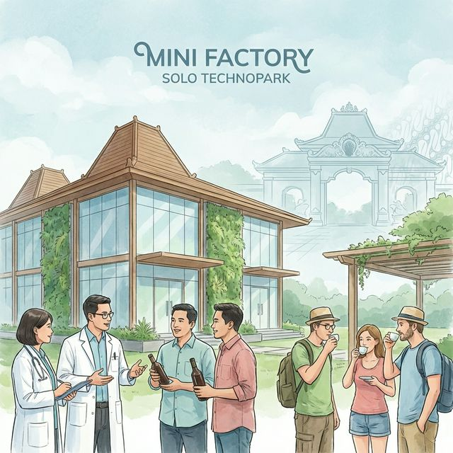
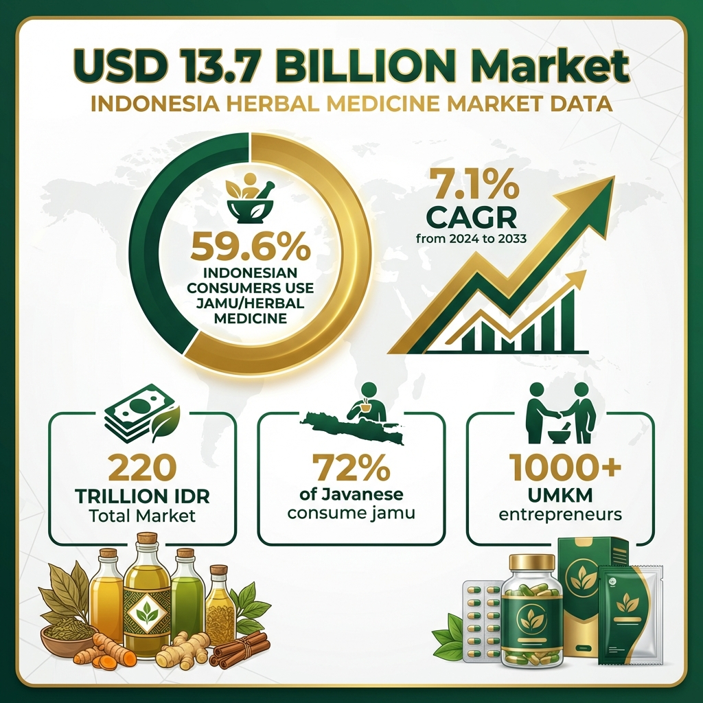
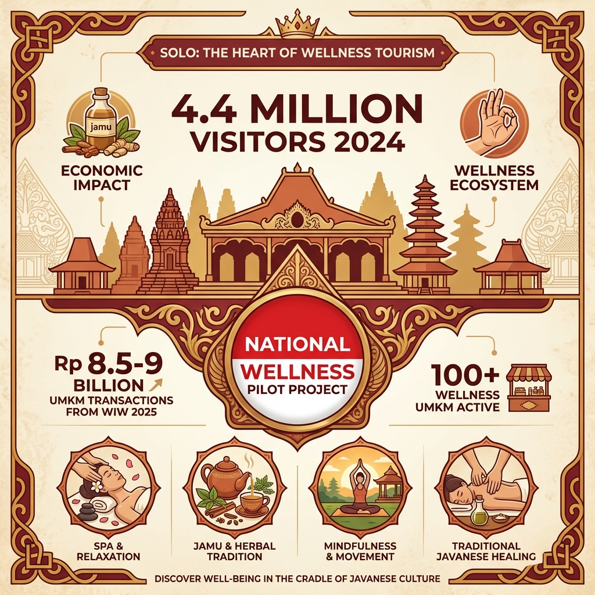
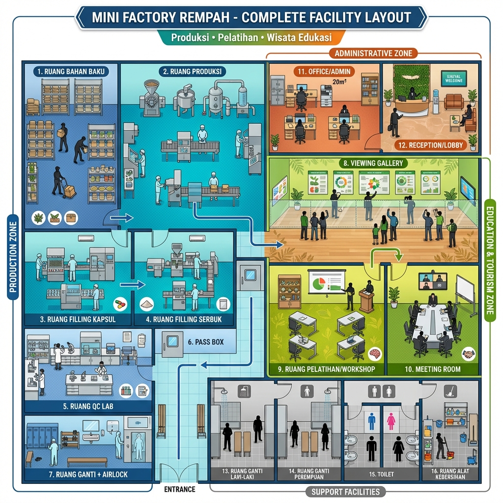
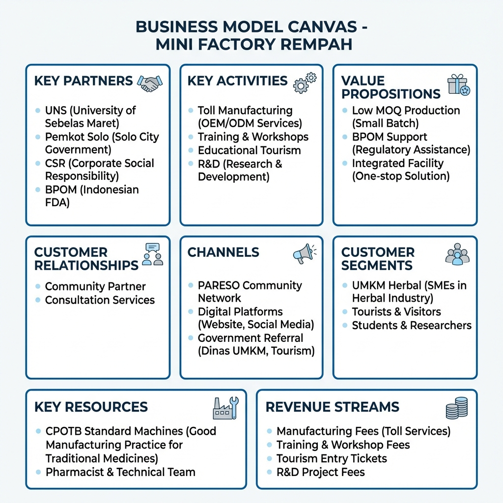
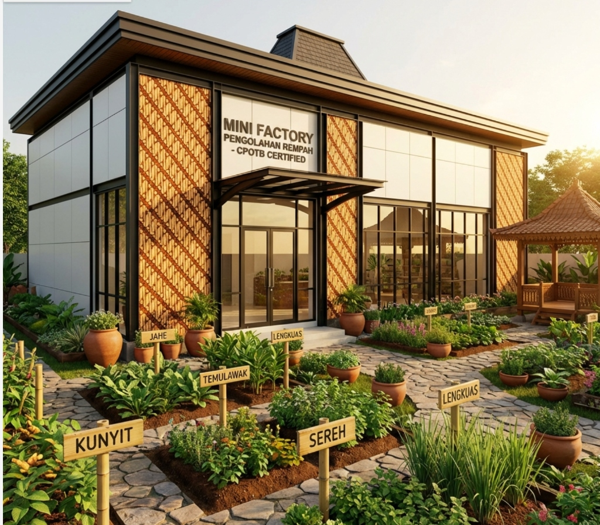
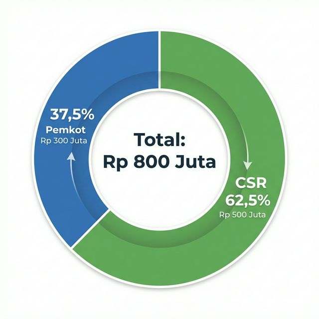
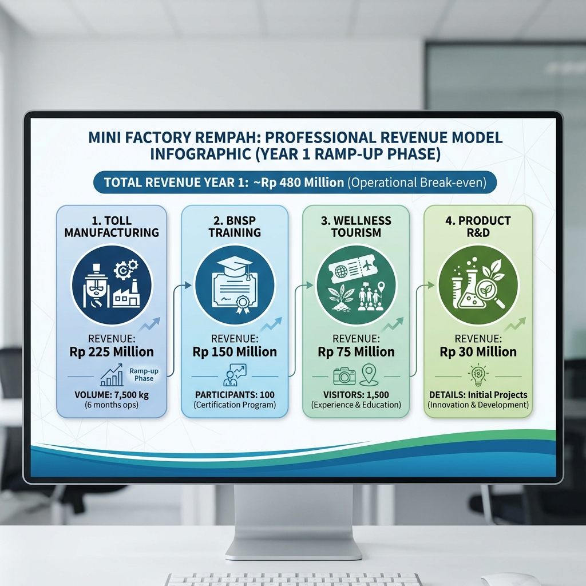

# PROPOSAL INVESTASI

**MINI FACTORY PENGOLAHAN REMPAH SOLO TECHNOPARK**
**Fasilitas Bersama CPOTB untuk Pemberdayaan 100 UMKM Herbal**

---

**Diajukan Kepada:**
Pemerintah Kota Surakarta

**Oleh:**
Tim Pengelola Mini Factory Solo Technopark

**Tanggal:**
Februari 2026

> **ℹ️ CATATAN:** Dokumen ini adalah **Versi Ringkas (Executive Summary)**.
> Proposal lengkap, detail teknis, dan visualisasi interaktif dapat diakses di:
> 🔗 **https://satyaaditech.github.io/mini-factory-cpotb/**

---

## 1. EXECUTIVE SUMMARY (RINGKASAN EKSEKUTIF)

**VISI:** Menjadikan Solo sebagai "Indonesia's Wellness Manufacturing Hub" melalui fasilitas produksi bersama standar CPOTB (Cara Pembuatan Obat Tradisional yang Baik) pertama di Jawa Tengah.

**THE OPPORTUNITY:**

*   **Permintaan Pasar:** Pasar herbal Indonesia senilai **Rp 220 Triliun** (2024) terus tumbuh.
*   **Potensi Lokal:** Solo memiliki **4.4 Juta Wisatawan** per tahun dan status "Wellness City".
*   **Masalah (The Gap):** 100+ UMKM herbal Solo terhambat di pasar informal karena tidak memiliki fasilitas produksi standar CPOTB, sehingga tidak bisa mendapatkan izin BPOM (Badan Pengawas Obat dan Makanan).

**SOLUSI: MINI FACTORY SOLO TECHNOPARK**
Fasilitas "Shared Factory" (Pabrik Bersama) 4-in-1 yang mengintegrasikan:
1.  **Produksi CPOTB:** Fasilitas maklon untuk UMKM (izin BPOM).
2.  **Pelatihan BNSP:** Pusat sertifikasi SDM herbal.
3.  **Wellness Tourism:** Destinasi wisata edukasi jamu.
4.  **R&D Center:** Pusat inovasi produk bersama UNS.

**INVESTASI & DAMPAK:**
*   **Total Kebutuhan Investasi:** **Rp 800.000.000** (Delapan Ratus Juta Rupiah).
    *   **Rp 300 Juta (Pemkot Surakarta):** Renovasi Bangunan & Utilitas Dasar.
    *   **Rp 500 Juta (CSR Mitra):** Pengadaan Mesin & Peralatan Produksi.
*   **Dampak Ekonomi:**
    *   Memberdayakan **100 UMKM** naik kelas (bisa masuk pasar modern).
    *   Menciptakan **200+ Lapangan Kerja** baru.
    *   Operasional Mandiri (Break-even) pada Tahun ke-2.

---

## 2. LATAR BELAKANG & PERMASALAHAN

### 2.1. The Gap: Mata Rantai yang Hilang

Meskipun pasar herbal sangat besar, UMKM Solo menghadapi "Missing Link" dalam ekosistem produksi:

| Fasilitas Existing | Keterbatasan bagi UMKM |
| :--- | :--- |
| **Pabrik Besar (IOT/UKOT)** | **High MOQ (Minimal Order Quantity - Jumlah Pesanan Minimum)** tinggi, tidak menerima produksi skala kecil UMKM. |
| **Pasar Jamu Nguter** | Hanya pusat perdagangan bahan baku/jadi, bukan fasilitas produksi standar higienis. |
| **Produksi Rumahan** | Tidak memenuhi standar CPOTB → Tidak lolos BPOM → Tidak bisa masuk ritel modern. |

> *Catatan: IOT = Industri Obat Tradisional; UKOT = Usaha Kecil Obat Tradisional.*

**Akibatnya:** UMKM "stuck" di level industri rumah tangga, pendapatan terbatas, dan kalah bersaing dengan produk impor atau pabrikan besar.

### 2.2. Momentum Strategis

1.  **Solo Wellness City:** Status Pilot Project Nasional Wellness Tourism memberikan branding kuat.
2.  **Permintaan Wisatawan:** Event "Wonderful Indonesia Wellness 2025" membuktikan potensi transaksi UMKM (Rp 8.5-9 Miliar).
3.  **Dukungan Regulasi:** Program Kemenperin dan BPOM saat ini sangat mendukung hilirisasi produk bahan alam.

---

## 3. SOLUSI: 4-IN-1 INTEGRATED ECOSYSTEM

Mini Factory didesain bukan hanya sebagai tempat produksi, tapi ekosistem lengkap:

### 🏭 Pilar 1: Fasilitas Produksi CPOTB (Core Business)

Fasilitas "Toll Manufacturing" (Jasa Maklon Produksi) dimana UMKM menyewa mesin dan ruang produksi terstandar.

*   **Kapasitas:** Melayani hingga 100 UMKM secara bergantian.
*   **Output:** 7,500 kg simplisia/tahun (Fase Ramp-up).
*   **Layanan:** Grinding (Penggilingan), Ekstraksi, Mixing (Pencampuran), Pengisian Kapsul, Packaging Sachet.
*   **Keunggulan:** UMKM mendapatkan produk Legal (BPOM) tanpa investasi mesin miliaran rupiah.

### 🎓 Pilar 2: Pusat Pelatihan & Sertifikasi BNSP

Mencetak SDM kompeten untuk industri obat tradisional.

*   **Program:** Certified Herbalist, Pengolah Herbal, QC Officer (Quality Control/Pengendali Mutu).
*   **Target:** 200 peserta sertifikasi per tahun.
*   **Mitra:** LSP (Lembaga Sertifikasi Profesi) terkait dan Dinas Tenaga Kerja.

### 🌿 Pilar 3: Destinasi Wellness Tourism

Mengintegrasikan pengalaman wisata ke dalam pabrik (Factory Tour).

*   **Konsep:** "Seeing is Believing" – Wisatawan melihat proses higienis melalui Viewing Gallery.
*   **Atraksi:** Sensory Garden (Taman Herbal), Workshop Pembuatan Jamu, Jamu Tasting Bar.
*   **Target:** 1,500 pengunjung wisatawan/tahun.

### 🔬 Pilar 4: R&D & Inovasi Produk

Pusat pengembangan produk (Research & Development) bekerjasama dengan Akademisi (UNS).

*   **Layanan:** Formulasi ulang resep, uji stabilitas, perbaikan kemasan.
*   **Tujuan:** Meningkatkan nilai jual dan daya simpan produk UMKM.

---

## 4. MODEL BISNIS & PETA STRATEGIS

Untuk memastikan keberlanjutan fasilitas tanpa bergantung selamanya pada subsidi, kami menerapkan model bisnis yang holistik.

### Strategi Penciptaan Nilai
Model bisnis ini mengintegrasikan fungsi layanan publik dengan keberlanjutan komersial:
1.  **Value Proposition (Nilai Tawar):** Kami menawarkan akses legalitas BPOM, solusi satu atap (produksi + izin), dan biaya produksi rendah (Shared Cost).
2.  **Customer Segments (Target Pasar):** UMKM Herbal Solo Raya (Core), Petani Rempah (Supplier), Wisatawan Wellness (Secondary), dan Start-up Kesehatan.
3.  **Revenue Streams (Arus Pendapatan):** Diversifikasi pendapatan dari Jasa Maklon, Pelatihan Bersertifikat, Tiket Wisata, dan Konsultasi R&D menjamin arus kas yang sehat.

---

## 5. DESAIN & SPESIFIKASI TEKNIS

### 5.1. Lokasi & Bangunan

*   **Lokasi:** Area Solo Technopark.
*   **Luas Bangunan:** ± 300 m² (Renovasi bangunan existing).
*   **Konsep Desain:** Modern Hygienic Interior (Standar Medis) dengan Eksterior Sentuhan Budaya Jawa (Batik/Joglo).

### 5.2. Layout Zoning (Standar CPOTB)
1.  **Grey Area (Gudang):** Penyimpanan bahan baku & kemasan.
2.  **White Area (Produksi):** Ruang terkontrol suhu & sistem tata udara (HVAC), lantai epoxy, dinding mudah dibersihkan.
    *   Ruang Giling & Ekstraksi.
    *   Ruang Filling (Kapsul/Sachet).
    *   Ruang Mixing.
3.  **Lab QC:** Ruang pengujian kualitas sederhana.
4.  **Public Area:** Galeri pengunjung, Ruang Pelatihan, Taman Herbal.

### 5.3. Alur Proses Produksi
Bahan Baku Masuk ➤ Sortasi & Cuci ➤ Pengeringan ➤ **PROSES UTAMA** (Giling/Ekstrak) ➤ **FILLING** (Kapsul/Sachet) ➤ Packaging Sekunder ➤ Quality Control ➤ Produk Jadi (Siap Edar).

---

## 6. RENCANA ANGGARAN BIAYA (INVESTASI)

Total kebutuhan investasi adalah **Rp 800.000.000,-** dengan skema pembiayaan kolaboratif:

### 6.1. Struktur Pendanaan

| Sumber Pendanaan | Nilai (Rp) | Peruntukan Utama |
| :--- | :--- | :--- |
| **1. PEMKOT SURAKARTA** | **300.000.000** | **Renovasi Fisik & Utilitas** |
| **2. CSR PERUSAHAAN** | **500.000.000** | **Mesin & Peralatan Produksi** |
| **TOTAL** | **800.000.000** | **Siap Operasi (Turnkey)** |

### 6.2. Rincian Penggunaan Dana

**A. Dana Pemkot (Rp 300 Juta)**
*Fokus: Menyiapkan "Rumah" yang layak dan sesuai standar BPOM.*

1.  **Pembangunan & Renovasi Gedung Operasional (Rp 300 Juta):**
    Mencakup pekerjaan sipil (penyekatan ruang cleanroom, lantai epoxy self-leveling, plafon gypsum anti-debu, pengecatan washable paint) serta sistem utilitas lengkap (Instalasi Listrik Industri, Sistem Tata Udara/HVAC dengan filter, dan Instalasi Air Bersih standar produksi).

**B. Dana CSR (Rp 500 Juta)**
*Fokus: Menyiapkan "Isi" (Mesin) agar pabrik bisa beroperasi menghasilkan uang.*

1.  **Mesin Pengolahan (Rp 300 Juta):** Mesin Penepung (Disk Mill/Hammer Mill), Mesin Ekstraktor Herbal, Mesin Mixing (Ribbon Mixer).
2.  **Mesin Packaging (Rp 100 Juta):** Mesin Filling Kapsul Semi-Otomatis, Mesin Sachet Vertical Packaging.
3.  **Peralatan Lab & Penunjang (Rp 100 Juta):** Alat gelas lab, timbangan digital presisi, pH meter, mikroskop sederhana, meja kerja stainless steel, rak penyimpanan gudang.

---

## 7. PROYEKSI FINANSIAL & DAMPAK

### 7.1. Model Pendapatan (Revenue Stream)

Target Pendapatan Tahun ke-1 Operasional (Fase Ramp-up): **Rp 480 Juta**.

1.  **Jasa Maklon (Toll Mfg):** Rp 225 Juta (Target: 50 UMKM aktif).
2.  **Pelatihan BNSP:** Rp 150 Juta (Target: 4 batch/tahun).
3.  **Tiket Wisata Edukasi:** Rp 75 Juta (Target: 1.500 pengunjung).
4.  **Jasa R&D:** Rp 30 Juta (Konsultasi produk).

### 7.2. Analisis Keuntungan (Profitability)
*   **Tahun 1 (2027):** Break-even Operasional (Pendapatan menutup Biaya Operasional). Fokus pada penetrasi pasar.
*   **Tahun 2 (2028):** Mulai mencetak Laba Bersih untuk reinvestasi/PAD.

### 7.3. Dampak Ekonomi & Sosial
*   **Efisiensi Biaya UMKM:** Menurunkan biaya produksi UMKM sebesar 30-40% dibandingkan investasi mandiri.
*   **Kenaikan Kelas UMKM:** 25-50 Izin Edar BPOM baru diterbitkan per tahun.
*   **Penyyerapan Tenaga Kerja:** Langsung (15 orang tim operasional), Tidak Langsung (300+ orang di sisi hulu pertanian & hilir pemasaran).

---

## 8. MITIGASI RISIKO

| Risiko | Mitigasi |
| :--- | :--- |
| **Keterlambatan Sertifikasi CPOTB** | Konsultasi intensif dengan BPOM sejak tahap desain (denah); Rekrutmen staff eks-industri farmasi. |
| **Adopsi UMKM Rendah** | Harga subsidi di tahun pertama; Kerjasama dengan Dinas Koperasi untuk mewajibkan penerima hibah menggunakan fasilitas. |
| **Funding CSR Meleset** | Skema investasi bertahap (Modular); Prioritas pada mesin produksi utama terlebih dahulu. |

---

## 9. PENUTUP & REKOMENDASI

Mini Factory Solo Technopark adalah solusi nyata dan terukur untuk masalah menahun UMKM herbal di Solo. Ini bukan sekadar proyek fisik, tetapi **investasi strategis** untuk membangun ekosistem ekonomi wellness yang berkelanjutan.

**Kami merekomendasikan Pemkot Surakarta untuk:**
1.  **Menyetujui alokasi anggaran Rp 300 Juta** untuk renovasi fasilitas di Solo Technopark pada TA 2026.
2.  **Mendukung tim pengelola** dalam proses penggalangan dana CSR sebesar Rp 500 Juta kepada mitra swasta strategis.
3.  **Menetapkan proyek ini sebagai Program Prioritas** pendukung "Solo Wellness City".

Demikian proposal ini kami ajukan. Atas dukungan dan perhatian Pemerintah Kota Surakarta, kami ucapkan terima kasih.

---

## 10. DATA PENGUSUL

**Nama Ketua Tim:** Yerma
**Jabatan:** Ketua Tim Pengelola Mini Factory
**Kontak (HP/WA):** 0821-3390-4353
**Email:** yermaning9@gmail.com
**Afiliasi:** Solo Technopark & ToraJava Art Foundation
**Alamat Kantor:** Kawasan Solo Technopark, Jl. Ki Hajar Dewantara No. 19, Jebres, Surakarta

---
*(Dokumen ini disiapkan untuk tujuan perencanaan dan penganggaran. Detail teknis DED dan spesifikasi mesin akan dituangkan dalam dokumen lampiran terpisah.)*
